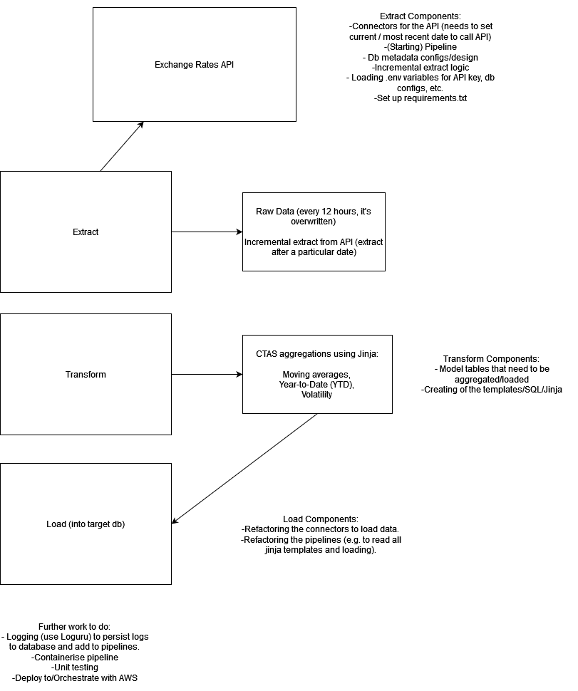
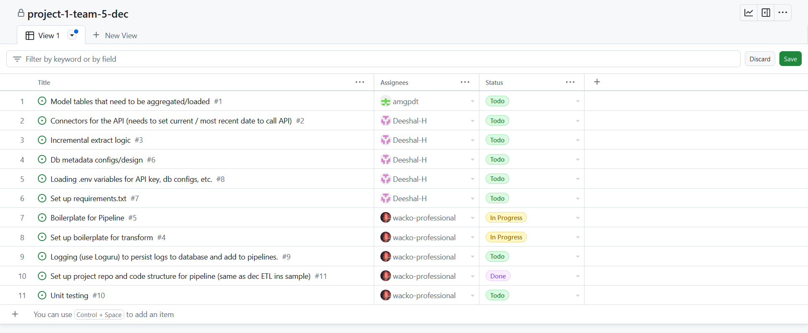

# ReadMe

## Objective

The objective of our project is to create an ETL pipeline to provide key metrics/aggregations of exchange rates from an API and persist them in a database.

## Consumers

The users  of our datasets are the data analysts and data scientists within the business (A travel agency organising tours worldwide).

They would be able to query these exchange rate metrics/aggregations from a PostgreSQL instance within AWS, to inform analytical decisions/modelling, such as but not limited to:

> - How/Whether to adjust package prices for different countries
> - How to hedge against future payments that will be made to foreign countries
> - Whether to pre-pay for services immediately or later based on currency forecasts, etc.

## Questions
> - What are the short- and long-term trends (based on moving averages) of select exchange rates/currencies?
> - Which exchange rate pairings have the highest relative strength today?
> - What is the performance of a currency from the start of the month to the current date (using MTD)?
> - How much did the rate change from a specific date to the rate on the same day last year (using YoY)?
> - Which currency/exchange rate pairings have been the most volatile over the past 6 months?

> These data would allow users to have an overview on the performance of selected currencies against one another.

## Source datasets
| Source name | Source type | Source documentation |
| - | - | - |
| [Exchange Rates API](https://exchangeratesapi.io/) | REST API | [Documentation](https://exchangeratesapi.io/documentation/) |

## Solution architecture

- Data extraction pattern will be incremental extracts with the latest date extracted stored for easier retrieval.
- Upsert pattern will be targeted. Update is performed for changes in a particular currency at a specific date while Insert will be done if the data is new.
- Transformation would utilize dags to ensure proper flow for the data wrangling and cleaning processes.

## Breakdown of tasks
### Rough Draft of the project

- The team will collaborate on each part of the pipeline. To do so, each pattern was broken down even further.

### Task List

- These are the distribution of tasks for the Extract component. Other tasks for the next features will eventually be added.