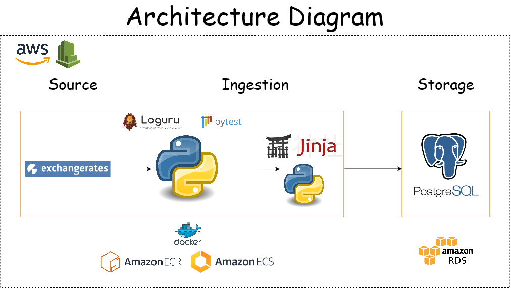
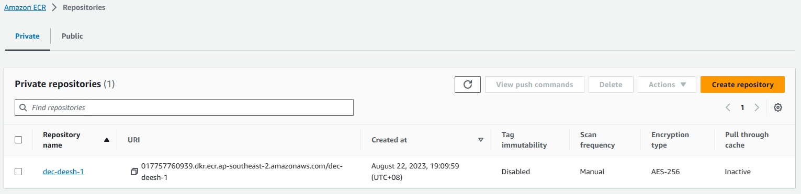
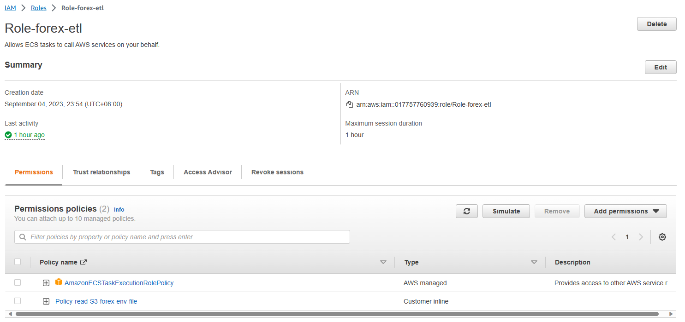
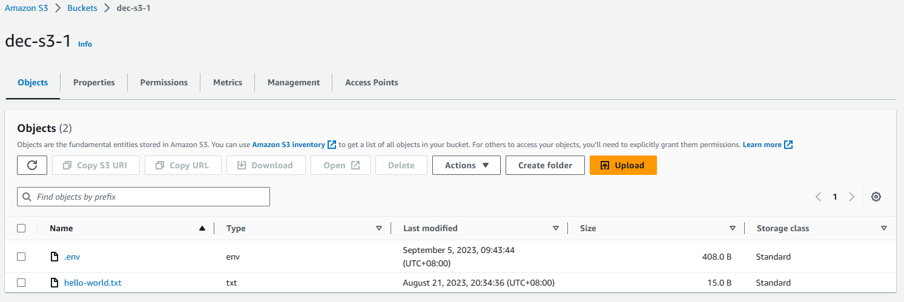
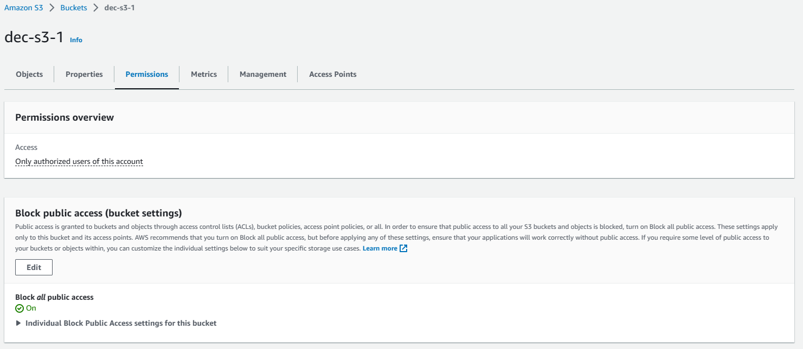

# Team 5 - Pipeline for serving relevant Exchange Rates Metrics

## Project Context and Goals
For a travel agency organising tours worlwide, data surrounding exchange rates plays an important role.
It impacts decisions surrounding:

1. Whether travel package prices for different countries should be adjusted,
2. How to hedge against future payments that will be made to foreign countries,
3. Whether to pre-pay for services immediately or later based on currency forecasts.

To this extent, it is important for the data analysts and data scientists working for the travel agency to have the following information:
1. What are the short- and long-term trends (based on moving averages) of select exchange rates/currencies?
2  Which exchange rate pairings have the highest relative strength today?
3. What is the performance of a currency from the start of the month to the current date (using MTD)?
4. How much did the rate change from a specific date to the rate on the same day last year (using YoY)?
5. Which currency/exchange rate pairings have been the most volatile over the past 6 months?

The goal of our project is therefore to create an ETL pipeline for providing the following key metrics/aggregations of exchange rates in order to help analysts/data scientists answer the aforementioned questions:
1. Month to Date: How much did a given currency change from the beginning of the month to the current date relative to another currency?
2. Moving Averages: What are the short-term (e.g. 7-day), medium-term (e.g. 30-day) and long-term (e.g. 90-day) trends of select exchange rates/currencies?
3. Relative Strengths: Which currency has the highest relative strength relative to another currency, today?
4. Year over Year: How much did a given exchange rate pairing change from a given date to the same time last year?
5. Volatility: Which exchange rate pairings have been the most volatile over the past 7 days?

## Datasets Selected
| Source name | Source type | Source documentation |
| - | - | - |
| [Exchange Rates API](https://exchangeratesapi.io/) | REST API | [Documentation](https://exchangeratesapi.io/documentation/) |

In the API, the group utilized both *latest rates* and *historical rates* endpoints which are the only ones available for the free tier.

## Solution architecture

## Techniques Applied
- An initial run was orchestrated manually to obtain 370 days worth of data, enough to calculate the YOY metric in an RDS PostgreSQL instance.
- The automated runs utilize an incremental extract wherein the max or latest date is queried from the database and is used as the process start date in the API.
- Data extracted by the automated runs are loaded into the same RDS instance as inserts.
- Calculation of various metrics are performed once the extract process completes; the transformation scripts are stored in jinja templates.
- All the aforementioned processes are containerized using docker and the images are uploaded into AWS ECR. AWS ECS is provisioned to run the whole pipeline at 24-hour intervals.

### Configurations of the AWS services:
#### Amazon Elastic Container Service (ECS)
Cluster:

Cluster - Scheduled Task:

#### Amazon Elastic Container Registry (ECR)
Repository:

Images:

#### Relational Database Service (RDS)
Database:

#### Identity and Access Management (IAM)
Role:

#### Simple Storage Service (S3)
Bucket (for .env file):

Bucket Permissions:

## Final Dataset and Demo Run

### This is a rough schema of the database.

**The group decided to store both the raw and serving datasets into one RDS instance only.**

## Lessons Learnt
- Setting up a composite key into each table can help in implementing upserts in future projects. (Gelo)
- CTEs can be used in "CREATE TABLE AS" commands and the whole CTE logic is useable in Jinja templates as well. (Gelo)