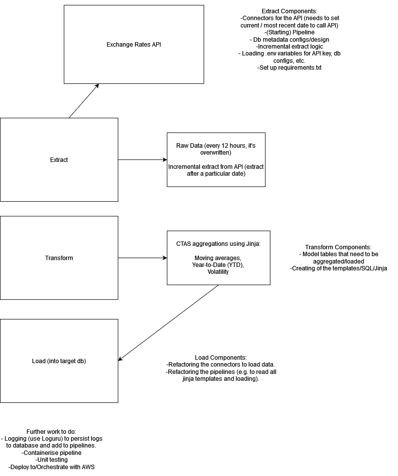
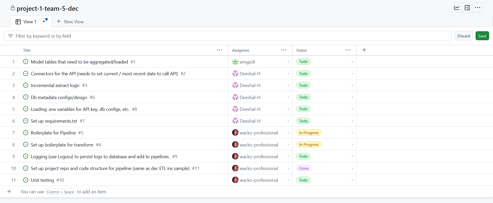

# Project plan 

## Objective 
> The project will allow the group to utilize the skills obtained from the first three modules of [Data Engineer Camp](https://dataengineercamp.com/) by providing ForEx analytical data from the exchange rates api. 

## Consumers 
> The users of the datasets can be Financial professionals focusing on ForEx analysis. The data can be acquired from a PostgreSQL instance within AWS.

## Questions 
> - What are the 7-day, 30-day, and 90-day averages for a particular currency?
> - What are the Highest and Lowest rate on a specific day/month/year?
> - What is the performance of a currency from the start of the month to the current date (using MTD)?
> - How much did the rate change from a specific date to the rate on the same day last year (using YoY)?

> These data would allow users to have an overview on the performance of a selecte currency.

## Source datasets 
| Source name | Source type | Source documentation |
| - | - | - |
| [Exchange Rates API](https://exchangeratesapi.io/) | REST API | [Documentation](https://exchangeratesapi.io/documentation/) |

## Solution architecture

- Data extraction pattern will be incremental extracts with the latest date extracted stored for easier retrieval.
- Upsert pattern will be targetted. Update is performed for changes in a particular currency at a specific date while Insert will be done if the data is new.
- Transformation would utilize dags to ensure proper flow for the data wrangling and cleaning processes. 

## Breakdown of tasks 
### Rough Draft of the project
 
- The team will collaborate on each part of the pipeline. To do so, each pattern was broken down even further.

### Task List

- These are the distribution of tasks for the Extract component. Other tasks for the next features will eventually be added.
